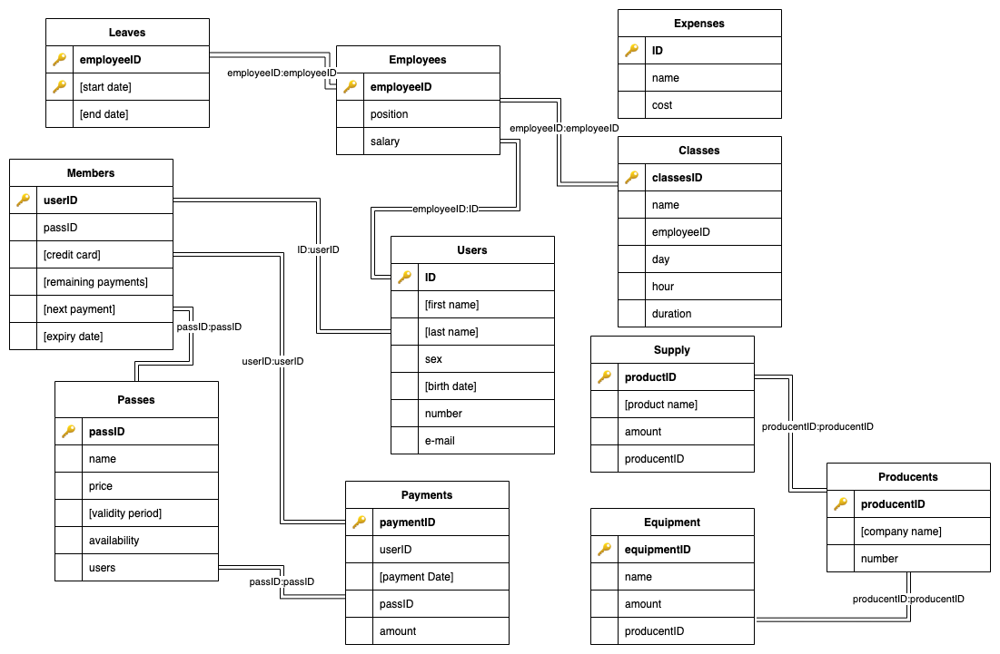
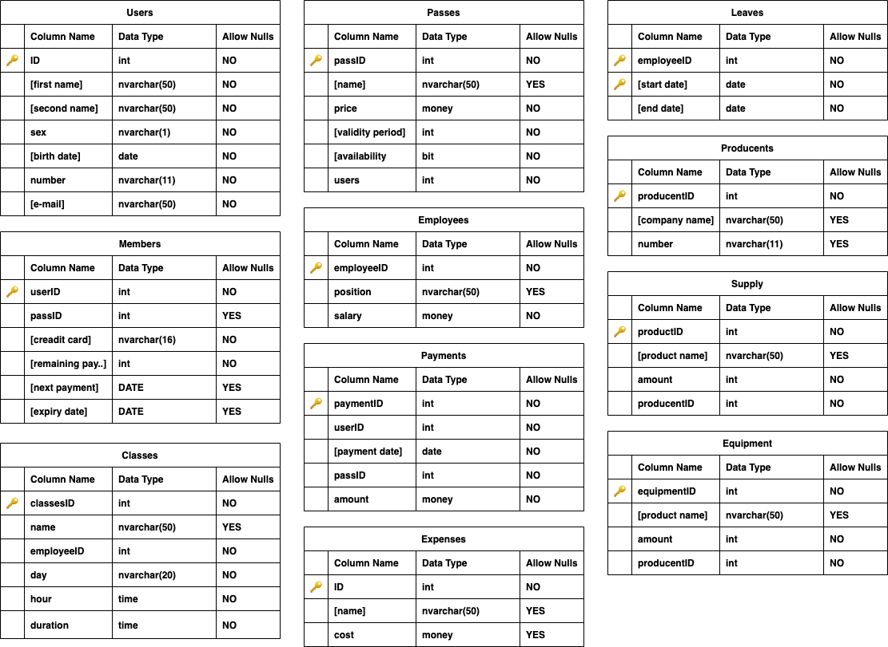

# Baza Danych Siłowni

Autor: Adrian Cielniak

# Założenia projektu

Celem projektu jest stworzenie bazy dancyh
siłowni ułatwiającej zarządzaniem poprzez sprawne monitorowanie najważniejszych aspektów takich jak wydatki, zarządzanie karnetami oraz płatnościami czy przechowywanie inforamcji o sprzęci oraz zaopatrzeniu. projekt narzuca pewne założenia dotyczące działania między innymi płatności lecz w łatwy sposób istnieje możliwość zmiany tak więc jest to projekt uniwersalny oraz praktyczny 

# Schemat Pielęgnacji 

Siłownia jest nieczynna nocą więc zalecam utwożenie róznicowej kopii zapasowej codziennie w godzinach noncyh oraz tworzenie pełnej kopii zapasowej w noncyh godzinach weekendowych

# Diagram ER



# Schemat Bazy Danych 



# Tabele

- Users
- Members
- Employees
- Passes
- Leaves
- Classes
- Payments
- Expenses
- Producents
- Supply
- Equipment

# Widoki

suma wszystkich wydatków

```sql
CREATE VIEW [all expensess] AS
    SELECT SUM(cost) AS [sum of expensess] FROM Expenses
```

dane dotyczące pracowników 

```sql
CREATE VIEW [employees data] AS
    SELECT Users.[first name], Users.[second name], Users.sex, position, salary,
    Users.[birth date], Users.[number], Users.[e-mail] FROM Employees
    JOIN Users ON Employees.employeeID = Users.ID
    ORDER BY [first name], [second name]
```

liczba osób z danym karnet

```sql
CREATE VIEW [persons per pass] AS
    SELECT [name] AS "pass name", users AS "amount of users" FROM Passes 
    ORDER BY users DESC
```

wypisuje wszystkich użytkowników którzy mają danego dnia urodziny

```sql
CREATE VIEW [birthday] AS
    SELECT [first name], [e-mail] FROM Users
    WHERE DAY(GETDATE()) = DAY([birth date])
    AND MONTH(GETDATE()) = MONTH([birth date])
```

wypsiuje dane dotyczące pracowników 

```sql
CREATE VIEW [employees personal data] AS
    SELECT Users.[first name], Users.[second name], Users.sex, position, salary,
    Users.[birth date], Users.[number], Users.[e-mail] FROM Employees
    JOIN Users ON Employees.employeeID = Users.ID
    ORDER BY [first name], [second name]
```

wypisuje dane dotyczące członków siłowni

```sql
CREATE VIEW [members personal data] AS
    SELECT Users.[first name], Users.[second name], Users.sex, Users.[birth date],
    Passes.[name], Users.[number], Users.[e-mail], [next payment] FROM Members
    JOIN Users ON Users.ID = Members.userID
    JOIN Passes ON Passes.PassID = Members.passID
    ORDER BY [firs name], [second name]
```

przychody z karnetów w obecnym dniu 

```sql
CREATE VIEW [earnings from passes] AS   
    SELECT [payment date],
    COUNT((SELECT paymentID FROM Payments
    WHERE CONVERT(DATE, GETDATE()) = [payment date])) AS "number of ticekt sold",
    SUM((SELECT amount FROM Payments
    WHERE CONVERT(DATE, GETDATE()) = [payment date])) AS "income" FROM Payments
```

informacje o sprzęcie wraz z danymi o producencie

```sql
CREATE VIEW [equipment data] AS
    SELECT [name], amount, Producents.[company name], Producents.number FROM Equipment
    JOIN Producents ON Equipment.producentID = Producents.producentID
    ORDER BY name
```

informacje o produktach wraz z danymi o producencie

```sql
CREATE VIEW [supply data] AS
    SELECT [name], amount, Producents.[company name], Producents.number FROM Supply
    JOIN Producents ON Supply.producentID = Producents.producentID
    ORDER BY name
```

lista danych osób które płacą danego dnia

```sql
CREATE VIEW [payment data] AS
    SELECT Users.[first name], Users.[second name], Passes.[name], Passes.price, [credit card] FROM Members 
    JOIN Users ON Users.ID = Members.userID
    JOIN Passes ON Passes.passID = Members.passID
    WHERE nextPayment = CONVERT(DATE, GETDATE())
    ORDER BY [first name], [second name]
```

# Funkcje 

wypisywanie planu zajęć dla danego dnia

```sql
CREATE FUNCTION classes_schedule (@day NVARCHAR(20))
RETURNS @schedule TABLE(
    [hour] NVARCHAR(50),
    [name] NVARCHAR(50),
    duration NVARCHAR(50),
    employee NVARCHAR(50)
)
AS
BEGIN
    IF @day NOT IN ('Monday', 'Tuesday', 'Wednesday', 'Thursday', 'Friday', 'Saturday', 'Sunday')
    BEGIN
        INSERT INTO @schedule VALUES('empty', 'empty', 'empty', 'empty')
    END
    ELSE
    BEGIN
    INSERT INTO @schedule 
        SELECT CONVERT(NVARCHAR(50), Classes.day), Classes.name, CONVERT(NVARCHAR(50), Classes.duration),
        CONCAT(Users.[first name], ' ', Users.[second name]) FROM Classes
        JOIN Users ON Classes.employeeID = Users.employeeID
        WHERE @day = Classes.[day]
        ORDER BY Claseses.[hour]
    END
    RETURN 
END
```

## Użycie funkcji 

```sql
SELECT * FROM classes_schedule('monday')
```

# Procedury Składowe

plan dla danego pracownika

```sql
GO
CREATE PROC employee_classes
@first_name NVARCHAR(50),
@second_name NVARCHAR(50)
AS
    SELECT [name], [day], [hour], [duration] FROM Classes C
    JOIN Users U ON C.employeeID = U.ID
    WHERE U.[first name] = @first_name AND U.[second name] = @second_name
    ORDER BY
        CASE    
          WHEN C.[day] = 'monday' THEN 1
          WHEN C.[day] = 'tuesday' THEN 2
          WHEN C.[day] = 'wednesday' THEN 3
          WHEN C.[day] = 'thursday' THEN 4 
          WHEN C.[day] = 'friday' THEN 5 
          WHEN C.[day] = 'saturday' THEN 6
          WHEN C.[day] = 'sunday' Then 7
        END, [hour]
GO
```

płatności danej osoby 

```sql
GO
CREATE PROC platnosci_osoby
@first_name NVARCHAR(50),
@second_name NVARCHAR(50)
AS
    SELECT [payment date], amount, Passes.[name] FROM Payments
    JOIN Passes ON Passes.passID = Payments.passID
    JOIN Users ON Users.ID = Payments.userID
    WHERE Users.[first name] = @first_name AND Users.[second name] = @second_name
    ORDER BY Payments.[payment date]
GO
```

dostępne karnety do danej kwoty

```sql
CREATE PROC passes_to
@amount MONEY
AS
    SELECT [name], price, [validity period], users FROM Passes
    WHERE price <= @amount AND availability = 1
    ORDER BY price DESC
GO
```

członkowie na daną litere 

```sql
GO
CREATE PROC czlonek_na_litere
(@letter CHAR)
AS
    SELECT [first name], [second name] FROM Members
    JOIN Users ON User.ID = Members.userID
    WHERE [second name] LIKE @letter + '%'
    ORDER BY [first name]
GO
```

wszystkie urlopy danego pracownika

```sql
GO
CREATE PROC urlopy_pracownika
@firs_name NVARCHAR(50),
@second_name NVARCHAR(50)
AS
    SELECT [start date], [end date] FROM Urlopy
    JOIN Users ON Users.ID = Urlopy.employeeID
    WHERE Users.[first name] = @first_name AND Users.[second name] = @second_name
    ORDER BY [start date]
GO
```

# Wyzwalacze

aktualizacja nowej daty płatności i zmniejszenie liczby pozostałych płatności

```sql
GO
CREATE TRIGGER new_paymant_date ON Payments
AFTER INSERT
AS  
    IF [remaining payments] > 0
        BEGIN
        UPDATE Members SET [next payment] = DATEADD(day, 30, [nextPayment]) 
        WHERE INSERTED.userID = Members.userID 
        END
    ELSE 
        BEGIN
            UPDATE Members
            SET [next payment] = NULL
            WHERE INSERTED.userID = Members.userID
        END
    UPDATE Members SET [remaing payments] = [remaining payments] - 1 
    WHERE INSERTED.userID = Members.userID
GO
```

dodanie do wydatków pensje pracowników

```sql
GO
CREATE TRIGGER add_payment ON Employees
AFTER INSERT 
AS
    UPDATE Expensess SET amount =
    (amount + (SELECT SUM(Employee.salary) FROM INSERTED, Employee WHERE Inserted.employeeID = Employee.employeeID))
    WHERE Expenses.[name] IN ('Salaries')
GO
```

odjecie od wydatków pensje pracowników 

```sql
GO
CREATE TRIGGER remove_payment ON Employees
AFTER DELETE 
AS
    UPDATE Expensess SET amount =
    (amount - (SELECT SUM(Employee.salary) FROM DELETED, Employee WHERE Inserted.employeeID = Employee.employeeID))
    WHERE Expenses.[name] IN ('Salaries')
GO
```

dodanie użytkownika danego karnetu

```sql
GO
CREATE TRIGGER add_user ON Members
AFTER INSERT 
AS
    IF(Inserted.passID IS NOT NULL)
    BEGIN
        UPDATE Passes SET Passes.users = Passes.users + 1
        WHERE Passes.passID = Inserted.passID
    END
GO
```

usunięcie użytkownika danego karnetu

```sql
GO
CREATE TRIGGER remove_user ON Members
AFTER DELETE 
AS
    IF(Deleted.passID IS NOT NULL)
    BEGIN
        UPDATE Passes SET Passes.users = Passes.users + 1
        WHERE Passes.passID = Deleted.passID
    END
GO
```


# Skrypt Tworzący Bazę Danych 

```sql
IF EXISTS(SELECT * FROM sys.databases WHERE NAME = 'gymDataBase')
    DROP DATABASE gymDataBase

CREATE DATABASE gymDataBase
```

```sql

--Uzytkownicy

CREATE TABLE Users(
    ID INT IDENTITY(1,1) PRIMARY KEY,
    [first name] NVARCHAR(50) NOT NULL,
    [second name] NVARCHAR(50) NOT NULL,
    sex NVARCHAR(1) NOT NULL,
    CHECK (sex = 'm' OR sex = 'f'),
    [birth date] DATE NOT NULL,
    [number] NVARCHAR(11) NOT NULL,
    CHECK (number NOT LIKE '%[^0-9]%'),
    [e-mail] NVARCHAR(50) NOT NULL
)

--Karnety

CREATE TABLE Passes(
    passID INT IDENTITY(1,1) PRIMARY KEY,
    [name] NVARCHAR(50) NOT NULL,
    price MONEY NOT NULL,
    [validity period] INT NOT NULL,
    [availability] BIT NOT NULL,
    users INT NOT NULL,
)

--Czlnkowie klubu, check na nnumer karty kredytowej

CREATE TABLE Members(
    userID INT REFERENCES Users PRIMARY KEY,
    passID INT REFERENCES Passes,
    [credit card] NVARCHAR(16) NOT NULL,
    CHECK ([credit card] NOT LIKE '%[^0-9]%'),
    [remaining payments] INT NOT NULL,
    [next payment] DATE,
    [expiry date] DATE
)

--Pracownicy

CREATE TABLE Employees(
    employeeID INT REFERENCES Users PRIMARY KEY,
    position NVARCHAR(50) NOT NULL,
    salary MONEY NOT NULL
)

--Platnosci

CREATE TABLE Payments(
    paymentID INT IDENTITY(1,1) PRIMARY KEY,
    userID INT REFERENCES Users NOT NULL,
    [payment date] DATE NOT NULL,
    passID INT REFERENCES Passes NOT NULL,
    amount MONEY NOT NULL
)

--Urlopy

CREATE TABLE Leaves(
    employeeID INT REFERENCES Employees,
    [start date] DATE NOT NULL,
    [end date] DATE NOT NULL,
    PRIMARY KEY(employeeID, [start date])
)

--Producenci, check na numer telefonu

CREATE TABLE Producents(
    producentID INT IDENTITY(1,1) PRIMARY KEY,
    [company name] NVARCHAR(50) NOT NULL,
    [number] NVARCHAR(11) NOT NULL,
    CHECK (number NOT LIKE '%[^0-9]%')
)

--Zaopatrzenie

CREATE TABLE Supply(
    productID INT IDENTITY(1,1) PRIMARY KEY,
    [product name] NVARCHAR(50) NOT NULL,
    amount INT NOT NULL,
    producentID INT REFERENCES Producents NOT NULL
)

--Wydatki

CREATE TABLE Expenses(
    ID INT IDENTITY(1,1) PRIMARY KEY,
    [name] NVARCHAR(50) NOT NULL,
    cost MONEY NOT NULL
)

--Wyposazenie

CREATE TABLE Equipment(
    equipmentID INT IDENTITY(1,1) PRIMARY KEY,
    [name] NVARCHAR(50) NOT NULL,
    amount INT NOT NULL,
    producentID INT REFERENCES Producents NOT NULL
)

--Zajecia, check na dany dzien tygodnia oraz godzine zajec oraz czas trawnaia

CREATE TABLE Classes(
    classesID INT IDENTITY(1,1) PRIMARY KEY,
    [name] NVARCHAR(50) NOT NULL,
    employeeID INT REFERENCES Employees NOT NULL,
    [day] NVARCHAR(20) NOT NULL,
    CHECK([day] IN ('monday', 'tuesday', 'wednesday', 'thursday', 'friday', 'saturday', 'sunday')),
    [hour] TIME NOT NULL,
    CHECK ([hour] BETWEEN '7:00:00' AND '21:00:00'),
    duration TIME NOT NULL,
    CHECK (duration <= '2:00:00')
)
```